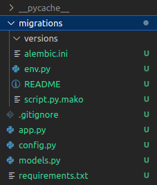
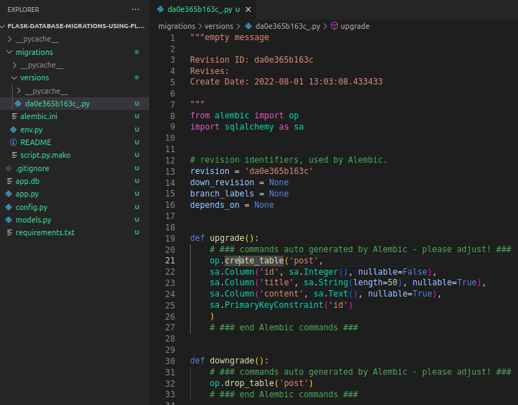
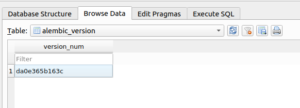
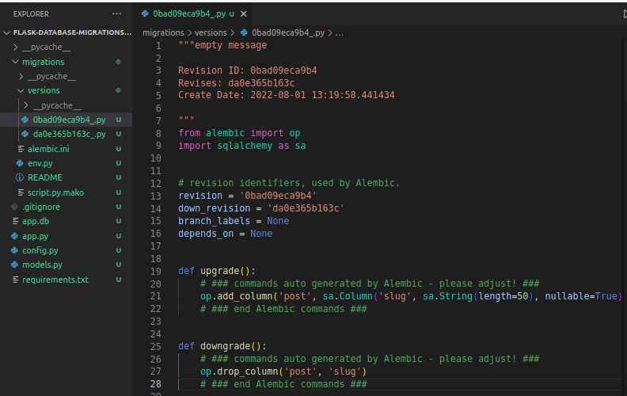
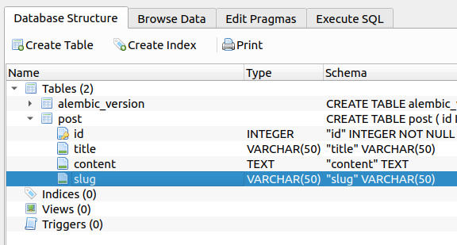
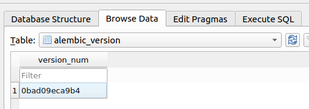

[Flask-Migrate](https://flask-migrate.readthedocs.io/en/latest/) is a python package that configures [SQLAlchemy](https://www.sqlalchemy.org/) and [Alembic](https://alembic.sqlalchemy.org/en/latest/) for your Flask application. Alembic is the migration tool that actually takes care of database migrations under the hood. It can automatically generate migration files based on database schema models, and apply those migrations to databases. **This is truly powerful, since it enables you to have a single source of truth and a history of your database changes in source control**. Using a database migration tool, you are able to easily upgrade or downgrade database changes, or even rebuild your database.

Now I will show how Flask-Migrate can be used in Flask applications. We will create a simple application with a database table for posts. I will show how to auto-generate migrations, how to apply migrations, how to downgrade, and how to automatically migrate the database when deploying your Flask application using Docker (bonus part).

Let’s start of with defining the needed dependencies by creating a requirements.txt file.

```text
Flask
Flask-Migrate
```

Install the dependencies using pip

```shell
pip install -r requirements.txt
```

The application configuration is specified in its own file config.py, where our Flask application, database, and Flask-Migrate are configured. This is a good way of avoiding circular dependencies, since these objects are often used in multiple places when it comes to Flask applications.

```python
from flask import Flask
from flask_migrate import Migrate
from flask_sqlalchemy import SQLAlchemy
 
app = Flask(__name__)
app.config['SQLALCHEMY_DATABASE_URI'] = '<replace-this-with-your-db-connection>'
app.config['SQLALCHEMY_TRACK_MODIFICATIONS'] = False
 
db = SQLAlchemy(app)
migrate = Migrate(app, db)
```

Next, we will define the database model schemas in models.py. In this example there is just one model for posts. Each model gets their own database table.

```python
from config import db
 
class Post(db.Model):
    id = db.Column(db.Integer, primary_key=True)
    title = db.Column(db.String(50))
    content = db.Column(db.Text())
```

The main script is app.py, that runs an HTTP server on port 5000 by default. Always remember to import models so that schema changes are detected.

```python
from config import app
from models import *
 
@app.route("/")
def index():
    return "<p>Index route!</p>"
 
if __name__ == '__main__':
    app.run(debug=True, host='0.0.0.0')
```

## SQLite limitations
In case you use SQLite and run into errors either when downgrading or upgrading your database, you should be aware that SQLite doesn’t have implementation for all operations and commands. I suggest reading [this blog post by Miguel Grinberg](https://blog.miguelgrinberg.com/post/fixing-alter-table-errors-with-flask-migrate-and-sqlite) for more information about SQLite limitations, and how to overcome them. I will not go deeper into that topic here, since readers of this post use all kinds of databases. My personal recommendation is to use Postgres for Flask applications.

## Initializing database repository
Next, we initialize our database repository using flask db init command. This will create a `migrations/` folder, where all migration files will be generated and live.

```shell
$ python3 -m flask db init
  Creating directory /home/kim/projects/blog-code/flask-database-migrations-using-flask-
  migrate/migrations ...  done
  Creating directory /home/kim/projects/blog-code/flask-database-migrations-using-flask-
  migrate/migrations/versions ...  done
  Generating /home/kim/projects/blog-code/flask-database-migrations-using-flask-
  migrate/migrations/script.py.mako ...  done
  Generating /home/kim/projects/blog-code/flask-database-migrations-using-flask-
  migrate/migrations/alembic.ini ...  done
  Generating /home/kim/projects/blog-code/flask-database-migrations-using-flask-
  migrate/migrations/env.py ...  done
  Generating /home/kim/projects/blog-code/flask-database-migrations-using-flask-
  migrate/migrations/README ...  done
  Please edit configuration/connection/logging settings in '/home/kim/projects/blog-code/flask-
  database-migrations-using-flask-migrate/migrations/alembic.ini' before proceeding.
```

After running the initalization command, you should be able to see something similar to this.



## Create migration
Since we already created our first database model Post, we can also generate our first migration using `flask db migrate command`. This will create a new migration file for any database schema changes you have made. Since we have now created our first database model, Alembic detects that a table for that corresponding model should be created.

```shell
$ python3 -m flask db migrate
INFO  [alembic.autogenerate.compare] Detected added table 'post'
  Generating /home/kim/projects/blog-code/flask-database-migrations-using-flask-
  migrate/migrations/versions/da0e365b163c_.py ...  done
```

Now you should find a new migration file under `migrations/versions/`. Notice that Alembic automatically created the needed SQL for creating a table based on the Post model we defined earlier. Each migration file has an upgrade function for applying the migration, and a `downgrade` function in case you want to rollback. Each migration file get its own `Revision ID`, which is a unique identifier for this particular migration.



**You are free to customize these migration files as needed**. Alembic is good at simple migrations like creating tables, adding/renaming columns etc. However, [alembic autogenerate feature has some limitations](https://alembic.sqlalchemy.org/en/latest/autogenerate.html#what-does-autogenerate-detect-and-what-does-it-not-detect). When it comes to more complex migrations, **alembic autogenerate is often a good place to start, however, you might have to edit migration files and add things to it depending on what you want to achieve**.

In case you haven’t changed any schemas and there isn’t anything for autogenerate to detect, but you still want to create a new migration, it’s possible to do so by creating an empty revision script. More information about commands can be found [here](https://flask-migrate.readthedocs.io/en/latest/#command-reference).

## Applying migrations
The previous step just created the migration file. Next step is to actually apply our migrations using `flask db upgrade` command. This command runs the migration files in correct order, and will always apply the latest changes.

```shell
$ python3 -m flask db upgrade
INFO  [alembic.runtime.migration] Running upgrade  -> da0e365b163c, empty message
```

If we now check our database, we can see that there are two tables. The `alembic_version` table is for Alembic to track migration version numbers. The second table is our `post` table, that was created as a result when we ran our migrations.


If we check the contents of the `alembic_version` table, we can see that the current version number matches the `Revision ID` of our first migration.



## Automatic schema change detection
Alembic can automatically detect SQLAlchemy schema changes. To demonstrate this, let’s add a slug column to our `Post` model.

```python
from config import db
 
class Post(db.Model):
    id = db.Column(db.Integer, primary_key=True)
    title = db.Column(db.String(50))
    content = db.Column(db.Text())
    slug = db.Column(db.String(50)) # new column
```

Now when we create a new migration, we can see that a new column was automatically detected, and thus alembic created a migration file for us.

```shell
$ python3 -m flask db migrate
INFO  [alembic.autogenerate.compare] Detected added column 'post.slug'
  Generating /home/kim/projects/blog-code/flask-database-migrations-using-flask-
  migrate/migrations/versions/0bad09eca9b4_.py ...  done
```

If we inspect the migration file, we can indeed see that the needed SQL to add a new column was automatically generated by alembic. Notice, that in addition to `revision` ID, alembic also keeps track of `down_revision` ID. This way alembic is able to upgrade and downgrade database migrations in the correct order.



Apply the latest migrations

```shell
$ python3 -m flask db upgrade
INFO  [alembic.runtime.migration] Running upgrade da0e365b163c -> 0bad09eca9b4, empty message
```

If we now check our database, we can see that the new column was added to our database.



Alembic version has also changed to the latest migration file that was applied.



## Downgrading to an older revision
With Flask-Migrate and Alembic, it is possible to downgrade to an older revision of your database. This can be done using the flask db downgrade command. By default it downgrades to the previous revision. You can also specify the revision you want to downgrade to `flask db downgrade <revision>`.

Here is an example of downgrading to the previous revision.

```shell
$ python3 -m flask db downgrade
INFO  [alembic.runtime.migration] Running downgrade 0bad09eca9b4 -> da0e365b163c, empty message
```

And if you want to return back to latest, just run flask db upgrade as we did earlier.

```shell
$ python3 -m flask db upgrade
INFO  [alembic.runtime.migration] Running upgrade da0e365b163c -> 0bad09eca9b4, empty message
```

## Deployment
When deploying the Flask application, the latest database migrations should be applied, in order for the application code and database tables to always be in sync. I will show how this can be done using [Docker](https://www.docker.com/) containers. This is just a demo to give you an idea how to deploy when using a migration library like Flask-Migrate/Alembic.

Before creating the docker container, let’s modify `app.py` to be a little bit more useful, by automatically creating a post on app startup in order for us to have some actual data in the database. In addition, let’s modify the existing web route to fetch posts from the database.

```python
from config import app, db
from models import *
 
def get_posts():
    return db.session.query(Post).all()
 
@app.route("/")
def index():
    posts = get_posts()
     
    html = ""
 
    if len(posts):
        for post in posts:
            html = html + f"<div><h1>{post.title}</h1><p>{post.content}</p><hr></div>"
 
    return html
 
if __name__ == '__main__':
    posts = get_posts()
    if not len(posts):
        new_post = Post(
            title="Example post",
            content="Hello world!",
            slug="example-post"
        )
        db.session.add(new_post)
        db.session.commit()
        print("Created post!")
 
    app.run(debug=True, host='0.0.0.0')
```

Start server by running the main application file. The server will be listening on [http://localhost:5000](http://localhost:5000).

```shell
$ python3 app.py 
Created post!
 * Serving Flask app 'config' (lazy loading)
 * Environment: production
   WARNING: This is a development server. Do not use it in a production deployment.
   Use a production WSGI server instead.
 * Debug mode: on
 * Running on all addresses (0.0.0.0)
   WARNING: This is a development server. Do not use it in a production deployment.
 * Running on http://127.0.0.1:5000
 * Running on http://192.168.10.51:5000 (Press CTRL+C to quit)
 * Restarting with stat
 * Debugger is active!
 * Debugger PIN: 751-988-947
```

We can see that a post was saved to the database, and our web route returns that post.


Let’s create a shell script `run.sh` that applies migrations and runs our Flask application. This script will be run when the container starts.

```shell
python3 -m flask db upgrade && python3 app.py
```

Below is a Dockerfile that has Python installed, adds our code to a container, installs dependencies and runs our shell script when the container starts.

```text
FROM python:3.8-alpine
 
WORKDIR /code
 
RUN apk add --no-cache gcc musl-dev linux-headers
 
COPY requirements.txt requirements.txt
 
RUN pip install -r requirements.txt
 
EXPOSE 5000
 
COPY . .
 
CMD ["sh", "run.sh"]
```

I like to use [docker-compose](https://docs.docker.com/compose/) for running containers locally. Here is a docker-compose.yml that builds our container based on the Dockerfile, and runs our application on port 8000 locally.

```yaml
version: "3.9"
services:
  app:
    build: .
    ports:
      - "8000:5000"
```

Before we start the container, make sure to empty your database or create a new one for testing this container deployment. This way we can test to see if we are able to rebuild the database using migrations.

Now it’s time to run our application in a container! Our application should be available on [http://localhost:8000](http://localhost:8000).

```shell
$ docker-compose up --build -d
Creating network "flask-database-migrations-using-flask-migrate_default" with the default driver
Building app
Step 1/8 : FROM python:3.8-alpine
 ---> 474c96543250
Step 2/8 : WORKDIR /code
 ---> Using cache
 ---> 9b0b81527ec7
Step 3/8 : RUN apk add --no-cache gcc musl-dev linux-headers
 ---> Using cache
 ---> c770018f11df
Step 4/8 : COPY requirements.txt requirements.txt
 ---> Using cache
 ---> e330c7511453
Step 5/8 : RUN pip install -r requirements.txt
 ---> Using cache
 ---> 8c641a436b46
Step 6/8 : EXPOSE 5000
 ---> Using cache
 ---> bd79e4c16dc3
Step 7/8 : COPY . .
 ---> Using cache
 ---> b1d5bd7fa53b
Step 8/8 : CMD ["sh", "run.sh"]
 ---> Using cache
 ---> b758c65798bb
 
Successfully built b758c65798bb
Successfully tagged flask-database-migrations-using-flask-migrate_app:latest
Creating flask-database-migrations-using-flask-migrate_app_1 ... done
```

It worked! The container is now reachable on port 8000. We managed to deploy our application using a container. When the container started, our script automatically ran alembic migrations in order to create the needed database tables. In addition, our Flask application was able to create a post and save it to the database.


This was by no means a perfect solution, but it at least showed how database migrations can be run when deploying Flask applications. Each time the source code changes or new database migrations are created, a new container can be deployed that automatically applies database changes and runs our application.

## Conclusion
That was it! We have now successfully added a database migration library to our Flask application. Flask-Migrate, SQLAlchemy and Alembic can automatically detect schema changes and create the needed migration files for our database. These migration files live with our application, and makes sure the application and its database are always in sync. These files allow us to version our database and have it in source control. We can easily upgrade, downgrade or even rebuild our databases from scratch, since we have a single source of truth.

The source code is available at <a href="https://github.com/kimlehtinen/blog-code/tree/main/flask-database-migrations-using-flask-migrate" target="_blank">https://github.com/kimlehtinen/blog-code/tree/main/flask-database-migrations-using-flask-migrate</a>

## Resources
- [Flask-Migrate](https://flask-migrate.readthedocs.io/en/latest/)
- [Alembic](https://alembic.sqlalchemy.org/en/latest/autogenerate.html#what-does-autogenerate-detect-and-what-does-it-not-detect)
