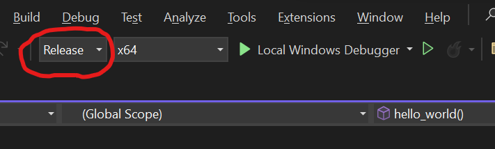
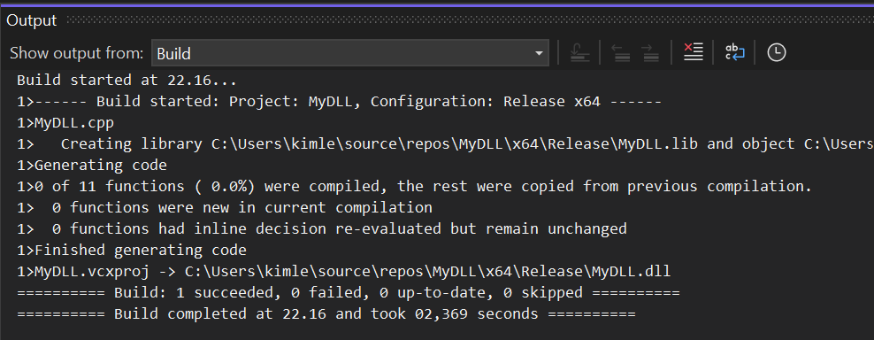
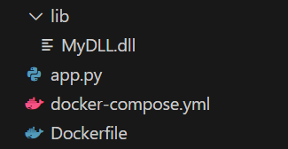
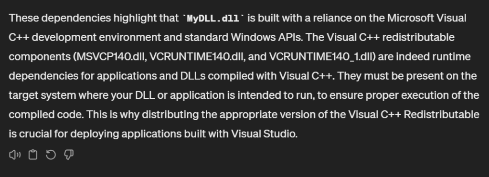

In the past few days, I have been working with Windows containers, and I have been facing issues with loading certain DLLs in these containers from my applications. It has been the classic “It works on my machine” problem, meaning it has been working without any issues on my host Windows machine. However, when running the same setup in Windows containers, the story has been different.

When I first got this DLL, I tried loading it from my main application, and everything worked out-of-the-box on my host Windows machine. I then containerized my application, loaded all dependencies there including this DLL, and ran the application in the container. The result: **ERROR, unable to find DLL.** I double checked that the DLL exists in the correct path, the path reference is correct, my host/container is 64bit, the DLL is 64bit, it’s not dependent on other DLLs to my knowledge, I can’t understand what has gone wrong!

This started to drive me completely insane! So much, that I decided to create the most simple example I can think of, somewhat resembling the setup of the application I was actually working on. Thus, I decided to create a new Windows server core container image, with a python script that tries to load a simple Hello World DLL built using C++ in Visual Studio, since I found out that the DLL I was working with was originally built using C++. If I start from scratch, I can start to eliminate things, and hopefully find a [solution](https://kimlehtinen.com/loading-microsoft-c-c-dlls-in-windows-containers/#solution).

## Hello World DLL

I followed [this guide](https://learn.microsoft.com/en-us/cpp/build/walkthrough-creating-and-using-a-dynamic-link-library-cpp?view=msvc-170) on how to create a simple DLL in Visual Studio C++. There they show how to build a Fibonacci DLL, however, I wanted an even simpler one, a single function that prints “Hello World!”. Below the header file is shown, defining our function.

```cpp
#pragma once

#ifdef MYDLL_EXPORTS
#define MYDLL_API __declspec(dllexport)
#else
#define MYDLL_API __declspec(dllimport)
#endif

extern "C" MYDLL_API void hello_world();
```

Next, we can create our C++ implementation, printing out hello world.

```cpp
#include "pch.h"
#include "MyDLL.h"
#include <iostream>

void hello_world()
{
	std::cout << "Hello World!";
}
```

By default when creating C++ project in Visual Studio, the “Debug” build configuration is selected. It is important to change it to **Release** or otherwise the DLL won’t run in the container. This is because only the host has the debug runtime redistributables that is installed when Visual Studio is installed. Those kinds of things don’t generally exist in environments where applications are deployed.



When we build this DLL through **Build > Build Solution**, Visual Studio generates the released version of our DLL.



Check the output for where the DLL is located. Keep track of it, we need it later on when copying it over to our container. I have a separate folder for my Docker setup, so I copy it over there under `.\lib` directory.

## Python script

Next, we can create a simple Python script that attempts to load this DLL.

```python
import ctypes

mydll = ctypes.CDLL('./lib/MyDLL.dll')

mydll.hello_world()
```

When running this script on our host, we can see that it works.

```
python .\app.py

Hello World!
```

## Windows container

Now it’s time to containerize this application. I’m using [Windows server core ltsc2022](https://hub.docker.com/_/microsoft-windows-servercore) that installs Python and pings localhost in order to start a process that keeps the container running.

```dockerfile
FROM mcr.microsoft.com/windows/servercore:ltsc2022

SHELL ["powershell", "-Command", "$ErrorActionPreference = 'Stop'; $ProgressPreference = 'SilentlyContinue';"]

# Install Python
RUN Invoke-WebRequest -Uri "https://www.python.org/ftp/python/3.11.0/python-3.11.0-amd64.exe" -OutFile "python-installer.exe"; \
    Start-Process python-installer.exe -ArgumentList '/quiet InstallAllUsers=1 PrependPath=1' -Wait; \
    Remove-Item python-installer.exe

# Test Python installation
RUN python --version

WORKDIR C:/user/src/app

# Keeps the container running.
CMD ["ping", "-t", "localhost"]
```

And for simplicity’s sake, let’s mount the whole directory to the container, so that we know we have the same setup, and can easily try things back and forth between host and container.

```yaml
version: '3.9'
services:
  windows-python:
    build: .
    container_name: win_py_container
    platform: windows
    volumes:
      - './:C:/user/src/app'
```

Here you can see my whole project structure



Now we can start the container

```
docker-compose up --build -d
```

The windows container has been started in the background, so let’s go inside it and start a powershell session

```
docker-compose exec windows-python powershell
```

Now you should be able to see same files in container just like in host, since we mounted the whole working directory (for demo purposes).

```
PS C:\user\src\app> ls


    Directory: C:\user\src\app


Mode                 LastWriteTime         Length Name
----                 -------------         ------ ----
d-----          3/7/2024  10:34 PM                lib
-a----          3/7/2024  10:25 PM             80 app.py
-a----          3/8/2024  10:23 PM            163 docker-compose.yml
-a----          3/8/2024   9:23 PM           1013 Dockerfile
```

Now if we run the python script in Windows container, we can see that it fails. It says it can’t find the DLL, even if it is there and is referenced correctly. It mentions “…or one of its dependencies”, but I created the most simple DLL, it should work as is…right?

```
PS C:\user\src\app> python .\app.py
Traceback (most recent call last):
  File "C:\user\src\app\app.py", line 3, in <module>
    mydll = ctypes.CDLL('./lib/MyDLL.dll')
            ^^^^^^^^^^^^^^^^^^^^^^^^^^^^^^
  File "C:\Program Files\Python311\Lib\ctypes\__init__.py", line 376, in __init__
    self._handle = _dlopen(self._name, mode)
                   ^^^^^^^^^^^^^^^^^^^^^^^^^
FileNotFoundError: Could not find module 'C:\user\src\app\lib\MyDLL.dll' (or one of its dependencies). Try using the full path with constructor syntax.
```

## Investigation begins

This is exactly what I ran into when I initially ran into problems loading DLLs in Windows container! Now the investigation begins. There can be many reasons for DLLs not being able to be loaded.

The following things are good things to check:
- Is your DLL located where expected
- Are you referencing the DLL path correctly in your application
- Is your DLL compatible with host/container architecture 32 vs. 64bit
- Does your DLL have other dependencies

The first ones are easy to check. Architecture can be checked in Visual Studio when building the DLL, make sure that you have selected 64 or 32 bit depending on where you intend to run it, most likely it is 64bit. If you haven’t built the DLL yourself, Visual Studio Developer Powershell terminal has dumpbin tool that can be used to check this. Since I built this for 64bit, I check here that I find `8664 machine (x64)`, and there it is!

```
dumpbin /HEADERS .\x64\Release\MyDLL.dll

Microsoft (R) COFF/PE Dumper Version 14.38.33134.0
Copyright (C) Microsoft Corporation.  All rights reserved.


Dump of file .\x64\Release\MyDLL.dll

PE signature found

File Type: DLL

FILE HEADER VALUES
            8664 machine (x64)
               ...
```

When I had come this far, I started giving up. However, after hours and hours of googling I found this [Github issues answer](https://github.com/dotnet/core/issues/4262#issuecomment-604710098), bingo, **Visual C++ runtime libraries**! Apparently native DLL libraries can require runtime libraries, and they don’t exist by default in Windows containers. I didn’t know that these kinds of DLLs have runtime libraries. Since my DLL was so simple, I thought it would work out-of-the-box, no extra dependencies. However, as mentioned [here](https://learn.microsoft.com/en-US/cpp/windows/latest-supported-vc-redist?view=msvc-170), when you use Microsoft C/C++ tools to build applications, it is quite likely that they require **Visual C++ Redistributable** runtime libraries installed in the environment you intend to run your application. You see, I have never built anything using Visual Studio before or Windows applications for that matter. Anyone who is experienced with these things probably found this obvious, but for the rest of us perhaps not so much.

I decided to compare my container and host to see what redistributables I have. First I checked the host, and that can be done with the following query below. We can see that a bunch of them are installed as I have Visual Studio installed on my host machine.

```
Get-WmiObject -Query "SELECT * FROM Win32_Product WHERE Name LIKE '%Microsoft Visual C++%'" | Select-Object Name, Version

Name                                                           Version
----                                                           -------
Microsoft Visual C++ 2022 X86 Debug Runtime - 14.38.33130      14.38.33130
Microsoft Visual C++ 2022 X86 Additional Runtime - 14.38.33130 14.38.33130
Microsoft Visual C++ 2022 X64 Additional Runtime - 14.38.33130 14.38.33130
Microsoft Visual C++ 2022 X64 Debug Runtime - 14.38.33130      14.38.33130
Microsoft Visual C++ 2022 X64 Minimum Runtime - 14.38.33130    14.38.33130
Microsoft Visual C++ 2022 X86 Minimum Runtime - 14.38.33130    14.38.33130
```

Next, I ran the same thing in container

```
PS C:\user\src\app> Get-WmiObject -Query "SELECT * FROM Win32_Product WHERE Name LIKE '%Microsoft Visual C++%'" | Select-Object Name, Version
```

Tadaa, empty output! And to be even more sure, one can use dumpbin on the DLL to check dependencies

```
dumpbin /DEPENDENTS .\x64\Release\MyDLL.dll

Microsoft (R) COFF/PE Dumper Version 14.38.33134.0
Copyright (C) Microsoft Corporation.  All rights reserved.


Dump of file .\x64\Release\MyDLL.dll

File Type: DLL

  Image has the following dependencies:

    MSVCP140.dll
    VCRUNTIME140_1.dll
    VCRUNTIME140.dll
    api-ms-win-crt-runtime-l1-1-0.dll
    KERNEL32.dll
```

Since I’m not familiar with these depdendencies, I naturally used ChatGPT for help to get more information about them. And indeed, ChatGPT confirmed that my DLL has Visual C++ redistributable runtime dependencies.



I also created this handy script to check if they exist in my container.

```powershell
$dllNames = @(
    'MSVCP140.dll',
    'VCRUNTIME140_1.dll',
    'VCRUNTIME140.dll',
    'api-ms-win-crt-runtime-l1-1-0.dll',
    'KERNEL32.dll'
)

$systemDir = [System.Environment]::SystemDirectory

foreach ($dllName in $dllNames) {
    $fullPath = Join-Path -Path $systemDir -ChildPath $dllName
    
    if (Test-Path -Path $fullPath) {
        Write-Output "$dllName exists."
    } else {
        Write-Output "$dllName does NOT exist."
    }
}
```

All are missing except one!

```
PS C:\user\src\app> .\check-dll-deps.ps1                                                                                             
MSVCP140.dll does NOT exist.                                                                                                         
VCRUNTIME140_1.dll does NOT exist.                                                                                                   
VCRUNTIME140.dll does NOT exist.                                                                                                     
api-ms-win-crt-runtime-l1-1-0.dll does NOT exist.                                                                                    
KERNEL32.dll exists.
```

## Solution

The solution is quite simple in the end, we have to download and install Visual C++ redistributables in the container. All downloads and different versions can be found at [Microsoft Visual C++ Redistributable latest supported downloads](https://learn.microsoft.com/en-US/cpp/windows/latest-supported-vc-redist?view=msvc-170). My DLL was built with Visual Studio 2022, so I chose the latest one.

The following shall be added to our Dockerfile, credit to this [StackOverflow answer](https://stackoverflow.com/a/73611701).

```dockerfile
RUN [Net.ServicePointManager]::SecurityProtocol = [Net.SecurityProtocolType]::Tls12; \
	Invoke-WebRequest "https://aka.ms/vs/17/release/vc_redist.x64.exe" -OutFile "C:\vc_redist.x64.exe"; \
	Start-Process -filepath C:\vc_redist.x64.exe -ArgumentList "/install", "/passive", "/norestart" -Passthru | Wait-Process; \
	Remove-Item -Force C:\vc_redist.x64.exe;
```

Here is the complete Dockerfile

```dockerfile
FROM mcr.microsoft.com/windows/servercore:ltsc2022

SHELL ["powershell", "-Command", "$ErrorActionPreference = 'Stop'; $ProgressPreference = 'SilentlyContinue';"]

# Install Python
RUN Invoke-WebRequest -Uri "https://www.python.org/ftp/python/3.11.0/python-3.11.0-amd64.exe" -OutFile "python-installer.exe"; \
    Start-Process python-installer.exe -ArgumentList '/quiet InstallAllUsers=1 PrependPath=1' -Wait; \
    Remove-Item python-installer.exe

# Test Python installation
RUN python --version

# Install Microsoft Visual C++ Redistributable
RUN [Net.ServicePointManager]::SecurityProtocol = [Net.SecurityProtocolType]::Tls12; \
	Invoke-WebRequest "https://aka.ms/vs/17/release/vc_redist.x64.exe" -OutFile "C:\vc_redist.x64.exe"; \
	Start-Process -filepath C:\vc_redist.x64.exe -ArgumentList "/install", "/passive", "/norestart" -Passthru | Wait-Process; \
	Remove-Item -Force C:\vc_redist.x64.exe;

WORKDIR C:/user/src/app

# Keeps the container running.
CMD ["ping", "-t", "localhost"]
```

Now let’s rebuild the container and go inside it

```
docker-compose down
docker-compose up --build -d
docker-compose exec windows-python powershell
```

Now we if run the Python script again in the container, we can see that it is able to load the DLL and run the hello world function! Finally!

```
PS C:\user\src\app> python .\app.py                                                                                                  
Hello World!
```

If we check the installed Visual C++ redistributables now in the container, we can see them listed this time

```
PS C:\user\src\app> Get-WmiObject -Query "SELECT * FROM Win32_Product WHERE Name LIKE '%Microsoft Visual C++%'" | Select-Object Name, Version                                                                                                                                                                                                                                                                  
Name                                                           Version                                                               
----                                                           -------                                                               
Microsoft Visual C++ 2022 X64 Additional Runtime - 14.38.33135 14.38.33135                                                           
Microsoft Visual C++ 2022 X64 Minimum Runtime - 14.38.33135    14.38.33135
```

And the runtime dependencies listed by `dumpbin` are existing now in the container as well. Only one is missing this time, however that one doesn’t seem to affect the application.

```
PS C:\user\src\app> .\check-dll-deps.ps1                                                                                             
MSVCP140.dll exists.                                                                                                                 
VCRUNTIME140_1.dll exists.                                                                                                           
VCRUNTIME140.dll exists.                                                                                                             
api-ms-win-crt-runtime-l1-1-0.dll does NOT exist.                                                                                    
KERNEL32.dll exists. 
```

I applied the same fix to my original application, and that solved the problem. The original DLL was also built using Microsoft C/C++ tools, and thus needs runtime dependencies. What I find interesting though is, that before this rabbit hole I have never installed Visual Studio or Visual C++ redistributables (knowingly) on my host machine. That’s why these things can go unnoticed.

## Conclusion

I’ve learned a lot through this struggle! That’s the best part about them. One day I wanted to load a DLL in a Windows container, and now as a result I know a lot more about loading DLLs built using Microsoft C/C++ tools. Computers and software we build are becoming more complex over time, and this makes sense also from that perspective. DLLs should be reusable, and that goes also for runtime dependencies in the environments like Windows, that allows Microsoft to maintain them independently from things developers build themselves.

Usually I build Linux containers, as most of you probably. However, every now and then I actually find use cases for Windows containers, and they are usually a bit more time consuming to get configured, and sometimes a lot more time consuming. Nonetheless, just the fact that they exist is amazing!

I hope you found this post useful, and that it helps anyone out there facing similar issues with loading DLLs in Windows containers. Here you find the [source code](https://github.com/kimlehtinen/blog-code/tree/main/loading-microsoft-c-c-dlls-in-windows-containers).

Happy containerizing!
