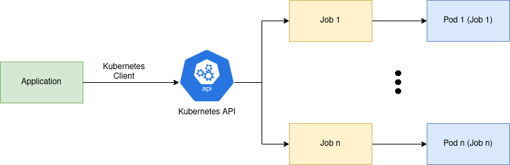

Containers are widely used for deploying and running applications. There are several benefits for containerizing applications. They offer a consistent environment for applications to be deployed to together with their dependencies. Containers are able to isolate workloads, and guarantee a certain amount of resources for each workload. In addition, they can be created fast, on the fly. This makes containers good for running resource-intensive workloads.

**Why not just use serverless?** Serverless functions are great for events and on-demand services, and would probably be my first choice for smaller tasks. However, they are often limited when it comes to long-running and resource-intensive tasks. By creating task-based containers instead, you have full control of the container environment the task will run in and how much resources it can use. In addition, it will be able to run for a long time. The focus of this post is to show how it can be done using Kubernetes. However, Kubernetes is not the only solution to achieve this. This is just one example.

Kubernetes is designed for scaling container workloads. Thanks to its declarative API, container workloads can easily be created, scheduled and automated. Kubernetes is well-suited for workloads at scale, since it automatically distributes workload across several server nodes. In addition, Kubernetes can automatically scale the number of nodes using [ClusterAutoscaler](https://github.com/kubernetes/autoscaler) based on the amount of resources used by the current workload. This is powerful when it comes to creating task-based containers using Kubernetes Jobs, since the cluster is able to scale accordingly.

Most commonly [kubectl CLI](https://kubernetes.io/docs/reference/kubectl/) is used to manage a cluster and for deploying workloads. However, since Kubernetes exposes a REST API, normal HTTP requests can be sent to [Kubernetes API](https://kubernetes.io/docs/concepts/overview/kubernetes-api/) to achieve the same things. To make this even easier, there already exists [Client Libraries](https://kubernetes.io/docs/reference/using-api/client-libraries/) for several programming languages that can be used to achieve the same things programmatically. This is powerful, since it allows for extending the possibilities of Kubernetes, by utilizing it's declarative and powerful API from our applications. This can for example be useful for retrieving metrics from the cluster, developing tools and for running workloads.

Kubernetes has specific objects designed for task-based containers. For scheduled workload, the [CronJob](https://kubernetes.io/docs/concepts/workloads/controllers/cron-jobs/) object can be used. Otherwise, the [Job](https://kubernetes.io/docs/concepts/workloads/controllers/job/) object can be used to create task-based containers. In this post, the Job object is used to demonstrate how task-based container workloads can be created programmatically using [Kubernetes Client for Python](https://github.com/kubernetes-client/python). However, you could use any other client to achieve the same things, it doesn't have to be Python Kubernetes Client.

In the diagram below, the concept of creating task-based containers using Kubernetes Jobs and Kubernetes Client is shown. The application to the left can interact with a Kubernetes cluster either directly via HTTP requests, or even more simply using an existing client library for the programming language used by the application. Kubernetes client libraries make it easy to connect to a cluster and for interacting with the cluster. If an application want to create a Kubernetes Job, all it has to do is to create a new Job object and post it to Kubernetes API. Kubernetes will automatically take care of creating the Job and run it in a Pod. The Pod container image includes the task program that should be executed.



In order not to waste resources, completed Jobs should be deleted. This is possible using Kubernetes [TTL feature](https://kubernetes.io/docs/concepts/workloads/controllers/job/#clean-up-finished-jobs-automatically) for Jobs. As a result, Kubernetes can automatically delete Jobs after they have completed. Jobs have a `.spec.ttlSecondsAfterFinished` property that can be used to specify after how many seconds after completion the Job should be deleted. When a Job is deleted, its Pods are deleted as well. This allows ClusterAutoscaler to automatically scale down when the number of Jobs decreases.

Applications using a Kubernetes Client can run both in the cluster itself or in a completely different environment. When a Kubernetes Client library connects to a Kubernetes cluster, it typically loads a [kubeconfig](https://kubernetes.io/docs/concepts/configuration/organize-cluster-access-kubeconfig/) through which the application is able to interact with the cluster. This file can for example be located locally on your computer, a server or in the cluster.

## Python example
The following example shows how task-based Kubernetes Jobs can be achieved using Python Kubernetes client. To begin with, we need a program that simulates a task to be deployed to a container. The following program `task.py` is a simple Python time sleeper, that will sleep for as many seconds as specified by a `--seconds` argument passed to the program.

```python
# task.py
import time
import argparse


parser = argparse.ArgumentParser("Time sleeper")
parser.add_argument("--seconds", help="the amount of seconds to sleep", type=int)
args = parser.parse_args()

print(f"Running task for {args.seconds} seconds...")

time.sleep(args.seconds)

print("Task done!")
```

This program is already available as a Docker image [here](https://kubernetes.io/docs/concepts/configuration/organize-cluster-access-kubeconfig/). This is what the Dockerfile looks like. By default, it will sleep for 5 seconds. However, this can be changed by overriding `CMD` in Docker or `args` in Kubernetes.

```dockerfile
FROM python:3.8-slim-buster

WORKDIR /app

COPY . .

ENTRYPOINT ["python3", "task.py", "--seconds"]

CMD ["5"]
```

The Kubernetes client for Python can be installed using `pip`.

```text
pip install kubernetes
```

Next, let's create a class for our Kubernetes client. The constructor first attempts to load kubeconfig in cluster, in case the application would be deployed to a cluster. If that fails, it will attempt to load the local kubeconfig file. The examples in this post are executed locally outside the cluster.

```python
# kubernetes_client.py (part 1/2)
import uuid
from kubernetes import client, config

class KubernetesClient:
    def __init__(self) -> None:
        try:
            self._kube_config = config.load_incluster_config()
        except Exception:
            self._kube_config = config.load_kube_config()
        
        api_client = client.ApiClient(configuration=self._kube_config)
        self._batch_client = client.BatchV1Api(api_client)
```

The following class method will create a Kubernetes `Job`, that runs the [python time sleeper docker image](https://hub.docker.com/repository/docker/kimlehtinen/python-time-sleeper). The method passes the amount of seconds to sleep for to the container. The `Job` will automatically be deleted 60 seconds after completion by setting `ttl_seconds_after_finished`. The Jobs are created in default namespace just for demo purpose.

```python
# kubernetes_client.py (part 2/2)
def create_job(self, seconds: int) -> None:
        name = f"job-{uuid.uuid4()}-{seconds}s"
        image = "kimlehtinen/python-time-sleeper:latest"
        namespace = "default"

        job = client.V1Job(
            api_version="batch/v1",
            kind="Job",
            metadata=client.V1ObjectMeta(name=name),
            spec=client.V1JobSpec(
                template=client.V1PodTemplateSpec(
                    metadata=client.V1ObjectMeta(
                        labels={"app": name},
                    ),
                    spec=client.V1PodSpec(
                        restart_policy="Never",
                        containers=[
                            client.V1Container(
                                name=name,
                                image=image,
                                image_pull_policy="Always",
                                resources=client.V1ResourceRequirements(
                                    requests={"cpu": "50m", "memory": "100Mi"},
                                    limits={"cpu": "100m", "memory": "150Mi"},
                                ),
                                args=[str(seconds)]
                            )
                        ],
                    ),
                ),
                backoff_limit=0,
                ttl_seconds_after_finished=60
            ),
        )

        self._batch_client.create_namespaced_job(namespace=namespace, body=job)

        print("Created: " + str(name))
```

Now, let's create a python script `create_task.py` that creates 3 Jobs using our `KubernetesClient`. The first Job will sleep for 5 seconds, the second for 10 seconds, and the third for 15 seconds.

```python
# create_task.py
from kubernetes_client import KubernetesClient

k8s_client = KubernetesClient()

k8s_client.create_job(seconds=5)
k8s_client.create_job(seconds=10)
k8s_client.create_job(seconds=15)
```

Before running the script, we can see that no Jobs or Pods are running in the default namespace of the cluster.

```text
$ kubectl get all
NAME                 TYPE        CLUSTER-IP   EXTERNAL-IP   PORT(S) 
service/kubernetes   ClusterIP   10.96.0.1    <none>        443/TCP 
```

Let's run the script that creates 3 Jobs!
```text
$ python3 create_task.py 
Created: job-9bd258f9-4f48-471c-8429-6327be03c8a7-5s
Created: job-92ade60e-e1a6-4cb8-85fa-8a62a9b3016a-10s
Created: job-c583e785-e993-4cb8-9594-4d7fc084f446-15s
```

Now if we check the default namespace, we see that 3 Jobs are currently running. Each `Job` has its corresponding `Pod` running the actual task. The Jobs `COMPLETIONS` column shows if the task is completed or not.

```text
$ kubectl get all
NAME                                                     READY   STATUS    RESTARTS   AGE
pod/job-92ade60e-e1a6-4cb8-85fa-8a62a9b3016a-10s-5f7lt   1/1     Running   0          11s
pod/job-9bd258f9-4f48-471c-8429-6327be03c8a7-5s-99cb6    1/1     Running   0          11s
pod/job-c583e785-e993-4cb8-9594-4d7fc084f446-15s-hbxw8   1/1     Running   0          11s

NAME                 TYPE        CLUSTER-IP   EXTERNAL-IP   PORT(S)   AGE
service/kubernetes   ClusterIP   10.96.0.1    <none>        443/TCP   176m

NAME                                                     COMPLETIONS   DURATION   AGE
job.batch/job-92ade60e-e1a6-4cb8-85fa-8a62a9b3016a-10s   0/1           11s        11s
job.batch/job-9bd258f9-4f48-471c-8429-6327be03c8a7-5s    0/1           11s        11s
job.batch/job-c583e785-e993-4cb8-9594-4d7fc084f446-15s   0/1           11s        11s
```

If we wait for a while, we see that the Jobs and Pods change to completed state.

```text
$ kubectl get all
NAME                                                     READY   STATUS      RESTARTS   AGE
pod/job-92ade60e-e1a6-4cb8-85fa-8a62a9b3016a-10s-5f7lt   0/1     Completed   0          34s
pod/job-9bd258f9-4f48-471c-8429-6327be03c8a7-5s-99cb6    0/1     Completed   0          34s
pod/job-c583e785-e993-4cb8-9594-4d7fc084f446-15s-hbxw8   0/1     Completed   0          34s

NAME                 TYPE        CLUSTER-IP   EXTERNAL-IP   PORT(S)   AGE
service/kubernetes   ClusterIP   10.96.0.1    <none>        443/TCP   176m

NAME                                                     COMPLETIONS   DURATION   AGE
job.batch/job-92ade60e-e1a6-4cb8-85fa-8a62a9b3016a-10s   1/1           26s        34s
job.batch/job-9bd258f9-4f48-471c-8429-6327be03c8a7-5s    1/1           18s        34s
job.batch/job-c583e785-e993-4cb8-9594-4d7fc084f446-15s   1/1           30s        34s
```

We can see from the logs that the task has been executed

```text
$ kubectl logs job.batch/job-c583e785-e993-4cb8-9594-4d7fc084f446-15s
Running task for 15 seconds...
Task done!
```

The Jobs were configured to be automatically deleted 60 seconds after completion. If you wait for 60 seconds after the last job has completed, you will see that Kubernetes has removed all resources related to these 3 Jobs.

```text
$ kubectl get all
NAME                 TYPE        CLUSTER-IP   EXTERNAL-IP   PORT(S)
service/kubernetes   ClusterIP   10.96.0.1    <none>        443/TCP 
```

That's it! We have now successfully created task-based containers using Kubernetes Jobs and Kubernetes Client for Python! I hope this goes to show that Kubernetes API is powerful when it comes to running task-based containers. In general building on top of Kubernetes using a client library is a powerful way to build systems and platforms that are scalable.

